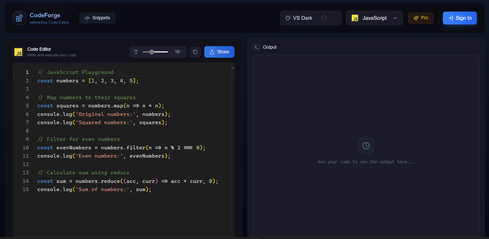
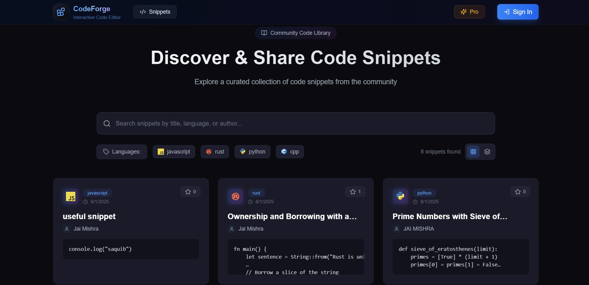
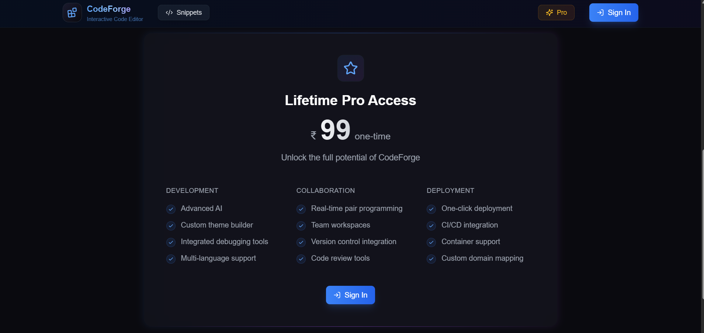

# CodeForge

An advanced online code editor built with modern web technologies, designed for developers to write, execute, and share code seamlessly. This editor supports multiple programming languages, themes, and customization options, making it ideal for both personal and professional use.

---

## 🔥 Preview

### 🧠 Code Editor


### 📚 Snippets Page


### 💎 Pro Subscription Page


---

## Highlights

- **🚀 Tech Stack:** Built using **Next.js 15**, **Convex**, **Clerk**, and **TypeScript** for a robust and scalable platform.
- **💻 Multi-language Support:** Write and execute code in **10 programming languages** with seamless switching.
- **🎨 Customizable Experience:** Choose from **5 VSCode themes** for a personalized coding environment.
- **✨ Smart Output Handling:** Displays results with **Success & Error states** for clear feedback.
- **💎 Flexible Pricing:** Offers both **Free** and **Pro** subscription plans.
- **🤝 Community-driven Sharing:** Share and discover code snippets via a **community-driven system**.
- **🔍 Advanced Search:** Use powerful **filtering and search capabilities** to find what you need quickly.
- **👤 Personal Profiles:** Track your execution history and save your work in **custom profiles**.
- **📊 Statistics Dashboard:** Get insights with a **comprehensive stats dashboard**.
- **⚙️ Customization:** Adjust the **font size** to your preference.
- **🔗 Webhook Integration:** Integrate with external services using **webhook support**.
- **🌟 Professional Deployment:** Includes a **step-by-step deployment walkthrough**.

---

## Setup

### Environment Variables

To configure the app, create a `.env` file in the root directory and add the following variables:

```env
NEXT_PUBLIC_CLERK_PUBLISHABLE_KEY=
CLERK_SECRET_KEY=
CONVEX_DEPLOYMENT=
NEXT_PUBLIC_CONVEX_URL=
```

Additionally, add these variables to the **Convex Dashboard**:

```env
CLERK_WEBHOOK_SECRET=
LEMON_SQUEEZY_WEBHOOK_SECRET=
```

### Installation and Running the App

1. Install the required dependencies:
   ```bash
   npm install
   ```
2. Run the development server:
   ```bash
   npm run dev
   ```
3. Open your browser and navigate to `http://localhost:3000` to access the application.

---

## Features

### Free Plan
- Access to basic features and 3 supported languages.
- Limited execution history and stats tracking.

### Pro Plan
- Full access to all 10 languages and advanced features.
- Community sharing, webhook integration, and stats dashboard.
- Priority support and professional deployment assistance.

---

## Contribution

We welcome contributions from the community! Please follow these steps:

1. Fork this repository.
2. Create a new branch:
   ```bash
   git checkout -b feature-name
   ```
3. Commit your changes:
   ```bash
   git commit -m 'Add new feature'
   ```
4. Push your branch:
   ```bash
   git push origin feature-name
   ```
5. Open a pull request.

---

## License

This project is licensed under the **MIT License**. Feel free to use, modify, and distribute this project.

---

## Contact

For support or inquiries, please contact the development team at **aditya03singh2003@gmail.com**.

Happy Coding! 🎉

